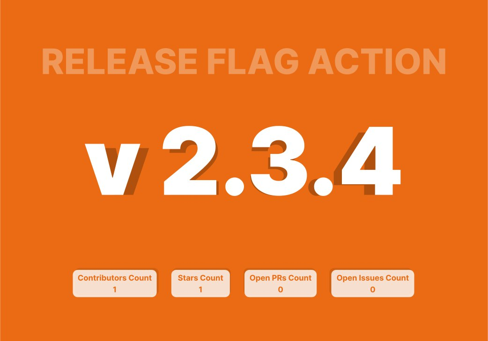

<h1><b>What is release-flag-action?</b></h1>

Release Flag Action is a github action that creates a release flag using some information from your repository and has the capability to post it via a telegram bot to the chats that you specify for.

<h1><b>How to use?</b></h1>

First of all, you should create a telegram bot using the [BotFather](https://telegram.me/BotFather) and take the bot token and also the `chat_id` of the group you want to send the release flag message to.

<details>
  <summary>How to get <code>chat_id</code> of a specific chat?</summary>
  First, you need to send a message with the content <mark>@[username_bot] /start</mark> to the chat you want to get the <code>chat_id</code> of.
  Then, send a request to the url below, hence you can get the parameter from the response.

  ```http
  GET https://api.telegram.org/bot<token>/getUpdates
  ```

</details>

<h1>Quick Start</h1>

Below is the general structure of the yaml file you can use to quick start with the action:

```yaml
on:
  release:
    types: [published]

jobs:
  release-flag:
    runs-on: ubuntu-latest
    steps:
      - name: Checkout
        uses: actions/checkout@v3
      - name: Action
        uses: DeeepDev/release-flag-action@v1
        with:
          repo_github_object: ${{ toJson(github) }}
          version: 2.3.4
          telegram_to: ${{ secrets.TELEGRAM_TO }}
          telegram_token: ${{ secrets.TELEGRAM_TOKEN }}
          telegram_message: "This is the *release flag* telegram message body"
```

<h1>Inputs</h1>

| Input Name                | Description                                                                                       | default     | required |
|---------------------------|---------------------------------------------------------------------------------------------------|-------------|----------|
| `repo_github_object`      | JSON of the github context object, which is used to extract general information of the repository | `undefined` | `true`   |
| `version`                 | Version of the published release                                                                  | `undefined` | `true`   |
| `prerelease`              | Whether the new version is prerelease or not                                                      | `false`     | `false`  |
| `flag_quality`            | DPI of the flag image produced                                                                    | `150`       | `false`  |
| `telegram_to`             | chat_id to send the message to                                                                    | `undefined` | `true`   |
| `telegram_token`          | telegram bot token                                                                                | `undefined` | `true`   |
| `telegram_message`        | telegram message                                                                                  | `undefined` | `true`   |
| `telegram_message_format` | telegram message format: MarkdownV2 or HTML or Markdown                                           | `Markdown`  | `false`  |

<h1>Sample Output</h1>

